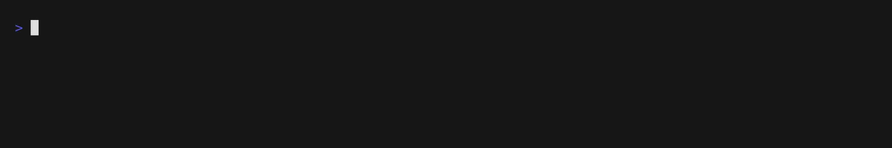
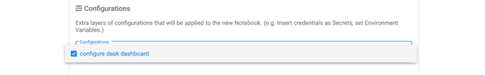

Installing
===========

.. currentmodule:: dask_kubernetes

Python package
--------------

You can install dask-kubernetes with ``pip``, ``conda``, or by installing from source.

Pip
^^^

Pip can be used to install dask-kubernetes and its Python dependencies::

   pip install dask-kubernetes --upgrade  # Install everything from last released version

Conda
^^^^^

To install the latest version of dask-kubernetes from the
`conda-forge <https://conda-forge.github.io/>`_ repository using
`conda <https://www.anaconda.com/downloads>`_::

    conda install dask-kubernetes -c conda-forge

Install from Source
^^^^^^^^^^^^^^^^^^^

To install dask-kubernetes from source, clone the repository from `github
<https://github.com/dask/dask-kubernetes>`_::

    git clone https://github.com/dask/dask-kubernetes.git
    cd dask-kubernetes
    python setup.py install

or use ``pip`` locally if you want to install all dependencies as well::

    pip install -e .

You can also install directly from git main branch::

    pip install git+https://github.com/dask/dask-kubernetes

Operator
--------

To use the Dask Operator you must install the custom resource definitions, service account, roles, and the operator controller deployment.

Quickstart
^^^^^^^^^^

.. code-block:: console

    $ helm install --repo https://helm.dask.org --create-namespace -n dask-operator --generate-name dask-kubernetes-operator

Installing with Helm
^^^^^^^^^^^^^^^^^^^^

The operator has a Helm chart which can be used to manage the installation of the operator.
The chart is published in the `Dask Helm repo <https://helm.dask.org>`_ repository, and can be installed via:

.. code-block:: console

    $ helm repo add dask https://helm.dask.org
    "dask" has been added to your repositories

    $ helm repo update
    Hang tight while we grab the latest from your chart repositories...
    ...Successfully got an update from the "dask" chart repository
    Update Complete. ⎈Happy Helming!⎈

    $ helm install --create-namespace -n dask-operator --generate-name dask/dask-kubernetes-operator
    NAME: dask-kubernetes-operator-1666875935
    NAMESPACE: dask-operator
    STATUS: deployed
    REVISION: 1
    TEST SUITE: None
    NOTES:
    Operator has been installed successfully.

Then you should be able to list your Dask clusters via ``kubectl``.

.. code-block:: console

   $ kubectl get daskclusters
   No resources found in default namespace.

We can also check the operator pod is running:

.. code-block:: console

   $ kubectl get pods -A -l app.kubernetes.io/name=dask-kubernetes-operator
   NAMESPACE       NAME                                        READY   STATUS    RESTARTS   AGE
   dask-operator   dask-kubernetes-operator-775b8bbbd5-zdrf7   1/1     Running   0          74s

.. warning::
    Please note that `Helm does not support updating or deleting CRDs. <https://helm.sh/docs/chart_best_practices/custom_resource_definitions/#some-caveats-and-explanations>`_ If updates
    are made to the CRD templates in future releases (to support future k8s releases, for example) you may have to manually update the CRDs or delete/reinstall the Dask Operator.

Single namespace
""""""""""""""""

By default the controller is installed with a ``ClusterRole`` and watches all namespaces.
You can also just install it into a single namespace by setting the following options.

.. code-block:: console

   $ helm install -n my-namespace --generate-name dask/dask-kubernetes-operator --set rbac.cluster=false --set kopfArgs="{--namespace=my-namespace}"
   NAME: dask-kubernetes-operator-1749875935
   NAMESPACE: my-namespace
   STATUS: deployed
   REVISION: 1
   TEST SUITE: None
   NOTES:
   Operator has been installed successfully.

Prometheus
""""""""""

The operator helm chart also contains some optional `ServiceMonitor` and `PodMonitor` resources to enable Prometheus scraping of Dask components.
As not all clusters have the Prometheus operator installed these are disabled by default. You can enable them with the following comfig options.

.. code-block:: yaml

   metrics:
      scheduler:
         enabled: true
         serviceMonitor:
            enabled: true
      worker:
         enabled: true
         serviceMonitor:
            enabled: true

You'll also need to ensure the container images you choose for your Dask components have the ``prometheus_client`` library installed.
If you're using the official Dask images you can install this at runtime.

.. code-block:: python

   from dask_kubernetes.operator import KubeCluster
   cluster = KubeCluster(name="monitored", env={"EXTRA_PIP_PACKAGES": "prometheus_client"})

Chart Configuration Reference
"""""""""""""""""""""""""""""

.. frigate:: ../../dask_kubernetes/operator/deployment/helm/dask-kubernetes-operator

Installing with Manifests
^^^^^^^^^^^^^^^^^^^^^^^^^

If you prefer to install the operator from static manifests with ``kubectl`` and set configuration options with tools like ``kustomize`` you can generate the default manifests with::

      $ helm template --include-crds --repo https://helm.dask.org release dask-kubernetes-operator | kubectl apply -f -

Kubeflow
^^^^^^^^

In order to use the Dask Operator with `Kubeflow <https://www.kubeflow.org/>`_ you need to perform some extra installation steps.

User permissions
""""""""""""""""

Kubeflow doesn't know anything about our Dask custom resource definitions so we need to update the ``kubeflow-kubernetes-edit`` cluster role. This role
allows users with cluster edit permissions to create pods, jobs and other resources and we need to add the Dask custom resources to that list. Edit the
existing ``clusterrole`` and add a new rule to the ``rules`` section for ``kubernetes.dask.org`` that allows all operations on all custom resources in our API namespace.

.. code-block:: console

     $ kubectl patch clusterrole kubeflow-kubernetes-edit --type="json" --patch '[{"op": "add", "path": "/rules/-", "value": {"apiGroups": ["kubernetes.dask.org"],"resources": ["*"],"verbs": ["*"]}}]'
     clusterrole.rbac.authorization.k8s.io/kubeflow-kubernetes-edit patched

Dashboard access
""""""""""""""""

If you are using the Jupyter Notebook service in KubeFlow there are a couple of extra steps you need to do to be able to access the Dask dashboard.
The dashboard will be running on the scheduler pod and accessible via the scheduler service, so to access that your Jupyter container will need to
have the `jupyter-server-proxy <https://github.com/jupyterhub/jupyter-server-proxy>`_ extension installed. If you are using the
`Dask Jupter Lab extension <https://github.com/dask/dask-labextension>`_ this will be installed automatically for you.

By default the proxy will only allow proxying other services running on the same host as the Jupyter server, which means you can't access the scheduler
running in another pod. So you need to set some extra config to tell the proxy which hosts to allow. Given that we can already execute arbitrary code
in Jupyter (and therefore interact with other services within the Kubernetes cluster) we can allow all hosts in the proxy settings with
``c.ServerProxy.host_allowlist = lambda app, host: True``.

The :class:`dask_kubernetes.operator.KubeCluster` and :class:`distributed.Client` objects both have a ``dashboard_link`` attribute that you can
view to find the URL of the dashboard, and this is also used in the widgets shown in Jupyter. The default link will not work on KubeFlow so you need
to change this to ``"{NB_PREFIX}/proxy/{host}:{port}/status"`` to ensure it uses the Jupyter proxy.

To apply these configuration options to the Jupyter pod you can create a ``PodDefault`` configuration object that can be selected when launching the notebook. Create
a new file with the following contents.

.. code-block:: yaml

      # configure-dask-dashboard.yaml
      apiVersion: "kubeflow.org/v1alpha1"
      kind: PodDefault
      metadata:
      name: configure-dask-dashboard
      spec:
      selector:
         matchLabels:
            configure-dask-dashboard: "true"
      desc: "configure dask dashboard"
      env:
         - name: DASK_DISTRIBUTED__DASHBOARD__LINK
            value: "{NB_PREFIX}/proxy/{host}:{port}/status"
      volumeMounts:
         - name: jupyter-server-proxy-config
         mountPath: /root/.jupyter/jupyter_server_config.py
         subPath: jupyter_server_config.py
      volumes:
         - name: jupyter-server-proxy-config
         configMap:
            name: jupyter-server-proxy-config
      ---
      apiVersion: v1
      kind: ConfigMap
      metadata:
      name: jupyter-server-proxy-config
      data:
      jupyter_server_config.py: |
         c.ServerProxy.host_allowlist = lambda app, host: True

Then apply this to your KubeFlow user's namespace with ``kubectl``. For example with the default ``user@example.com`` user
it would be.

.. code-block:: console

   $ kubectl apply -n kubeflow-user-example-com -f configure-dask-dashboard.yaml

Then when you launch your Jupyter Notebook server be sure to check the ``configure dask dashboard`` configuration option.

Supported Versions
------------------

Python
^^^^^^

All Dask projects generally follow the `NEP 29 <https://numpy.org/neps/nep-0029-deprecation_policy.html>`_ deprecation policy for Python where each Python minor version is support ed for 42 months.
Due to Python's 12 month release cycle this ensures at least the current version and two previous versions are supported.

The Dask Kubernetes CI tests all PRs against all supported Python versions.

Kubernetes
^^^^^^^^^^

For Kubernetes we follow the `yearly support KEP <https://kubernetes.io/releases/patch-releases/#support-period>`_.
Due to the 4-6 month release cycle this also ensures that at least the current and two previous versions are supported.

The Dask Kubernetes CI tests all PRs against all supported Kubernetes versions.

.. note::

    To keep the CI matrix smaller we test all Kubernetes versions against the latest Python, and all Python versions against the latest Kubernetes.
    We do not test older versions of Python and Kubernetes together. See `dask/dask-kubernetes#559 <https://github.com/dask/dask-kubernetes/pull/559>`_ for more information.
