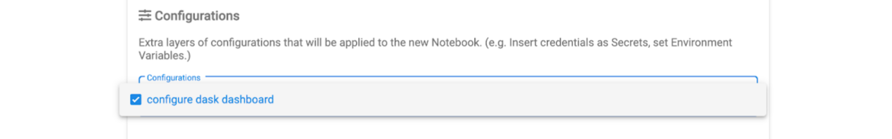

Installing
==========

Installing with manifests
-------------------------

To install the the operator first we need to create the Dask custom resources:

.. code-block:: console

   $ kubectl apply -f https://raw.githubusercontent.com/dask/dask-kubernetes/main/dask_kubernetes/operator/deployment/manifests/daskcluster.yaml
   $ kubectl apply -f https://raw.githubusercontent.com/dask/dask-kubernetes/main/dask_kubernetes/operator/deployment/manifests/daskworkergroup.yaml
   $ kubectl apply -f https://raw.githubusercontent.com/dask/dask-kubernetes/main/dask_kubernetes/operator/deployment/manifests/daskjob.yaml
   $ kubectl apply -f https://raw.githubusercontent.com/dask/dask-kubernetes/main/dask_kubernetes/operator/deployment/manifests/daskautoscaler.yaml

Then you should be able to list your Dask clusters via ``kubectl``.

.. code-block:: console

   $ kubectl get daskclusters
   No resources found in default namespace.

Next we need to install the operator itself. The operator is a small Python application that will watch the Kubernetes API for new Dask custom resources being created and add/remove pods/services/etc to create them.

.. code-block:: console

   $ kubectl apply -f https://raw.githubusercontent.com/dask/dask-kubernetes/main/dask_kubernetes/operator/deployment/manifests/operator.yaml

This will create the appropriate roles, service accounts and a deployment for the operator. We can check the operator pod is running:

.. code-block:: console

   $ kubectl get pods -A -l application=dask-kubernetes-operator
   NAMESPACE       NAME                                        READY   STATUS    RESTARTS   AGE
   dask-operator   dask-kubernetes-operator-775b8bbbd5-zdrf7   1/1     Running   0          74s

Installing with Helm
--------------------

Alternatively, the operator has a basic Helm chart which can be used to manage the installation of the operator.
The chart is published in the `Dask Helm repo <https://helm.dask.org>`_ repository, and can be installed via:

.. code-block:: console

    $ helm repo add dask https://helm.dask.org && helm repo update
    $ kubectl create ns dask-operator
    $ helm install --namespace dask-operator dask-operator dask/dask-kubernetes-operator

This will install the custom resource definitions, service account, roles, and the operator deployment.

.. warning::
    Please note that `Helm does not support updating or deleting CRDs. <https://helm.sh/docs/chart_best_practices/custom_resource_definitions/#some-caveats-and-explanations>`_ If updates
    are made to the CRD templates in future releases (to support future k8s releases, for example) you may have to manually update the CRDs.

Kubeflow
--------

In order to use the Dask Operator with `Kubeflow <https://www.kubeflow.org/>`_ you need to perform some extra installation steps.

User permissions
^^^^^^^^^^^^^^^^

Kubeflow doesn't know anything about our Dask custom resource definitions so we need to update the ``kubeflow-kubernetes-edit`` cluster role. This role
allows users with cluster edit permissions to create pods, jobs and other resources and we need to add the Dask custom resources to that list. Edit the
existing ``clusterrole`` and add a new rule to the ``rules`` section for ``kubernetes.dask.org`` what allows all operations on all custom resources.

.. code-block:: console

     $ kubectl patch clusterrole kubeflow-kubernetes-edit --type="json" --patch '[{"op": "add", "path": "/rules/-", "value": {"apiGroups": ["kubernetes.dask.org"],"resources": ["*"],"verbs": ["*"]}}]'
     clusterrole.rbac.authorization.k8s.io/kubeflow-kubernetes-edit patched

Dashboard access
^^^^^^^^^^^^^^^^

If you are using the Jupyter Notebook service in KubeFlow there are a couple of extra steps you need to do to be able to access the Dask dashboard.
The dashboard will be running on the scheduler pod and accessible via the scheduler service, so to access that your Jupyter container will need to
have the `jupyter-server-proxy <https://github.com/jupyterhub/jupyter-server-proxy>`_ extension installed. If you are using the
`Dask Jupter Lab extension <https://github.com/dask/dask-labextension>`_ this will be installed automatically for you.

By default the proxy will only allow proxying other services running on the same host as the Jupyter server, which means you can't access the scheduler
running in another pod. So you need to set some extra config to tell the proxy which hosts to allow. Given that we can already execute arbitrary code
in Jupyter (and therefore interact with other services within the Kubernetes cluster) we can allow all hosts in the proxy settings with
``c.ServerProxy.host_allowlist = lambda app, host: True``.

The :class:`dask_kubernetes.operator.KubeCluster` and :class:`distributed.Client` objects both have a ``dashboard_link`` attribute that you can
view to find the URL of the dashboard, and this is also used in the widgets shown in Jupyter. The default link will not work on KubeFlow so you need
to change this to ``"{NB_PREFIX}/proxy/{host}:{port}/status"`` to ensure it uses the Jupyter proxy.

To apply these configuration options to the Jupyter pod you can create a ``PodDefault`` configuration object that can be selected when launching the notebook. Create
a new file with the following contents.

.. code-block:: yaml

      # configure-dask-dashboard.yaml
      apiVersion: "kubeflow.org/v1alpha1"
      kind: PodDefault
      metadata:
      name: configure-dask-dashboard
      spec:
      selector:
         matchLabels:
            configure-dask-dashboard: "true"
      desc: "configure dask dashboard"
      env:
         - name: DASK_DISTRIBUTED__DASHBOARD__LINK
            value: "{NB_PREFIX}/proxy/{host}:{port}/status"
      volumeMounts:
         - name: jupyter-server-proxy-config
         mountPath: /root/.jupyter/jupyter_server_config.py
         subPath: jupyter_server_config.py
      volumes:
         - name: jupyter-server-proxy-config
         configMap:
            name: jupyter-server-proxy-config
      ---
      apiVersion: v1
      kind: ConfigMap
      metadata:
      name: jupyter-server-proxy-config
      data:
      jupyter_server_config.py: |
         c.ServerProxy.host_allowlist = lambda app, host: True

Then apply this to your KubeFlow user's namespace with ``kubectl``. For example with the default ``user@example.com`` user
it would be.

.. code-block:: console

   $ kubectl apply -n kubeflow-user-example-com -f configure-dask-dashboard.yaml

Then when you launch your Jupyter Notebook server be sure to check the ``configure dask dashboard`` configuration option.

